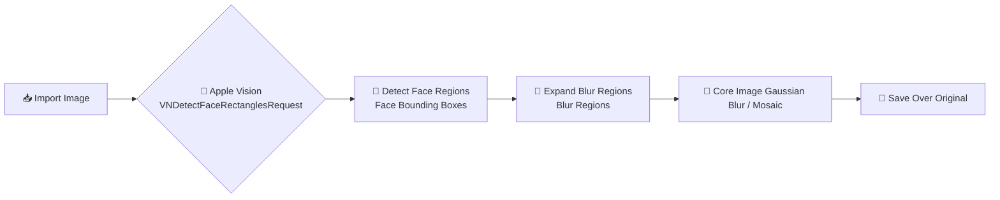

<div align="center">

# Masaiki · 马赛克工具

**Lightweight macOS Image Blur Tool**

[](https://github.com/jhihhe/masaiki)
[](https://swift.org)
[](https://developer.apple.com/xcode/swiftui/)
[](https://www.apple.com/macos)
[](https://github.com/jhihhe/masaiki)
[](LICENSE)
[](./Masaiki.dmg)

<p>
  <a href="README.zh.md">中文</a> •
  <a href="#features">Features</a> •
  <a href="#installation">Install</a> •
  <a href="#usage">Usage</a> •
  <a href="#build-from-source">Build</a> •
  <a href="#changelog">Changelog</a>
</p>

</div>

---

## Features

| Feature | Description |
|---------|-------------|
| 📁 **Batch Import** | Import multiple JPG / PNG / HEIC / TIFF images at once, with drag-and-drop support for files and folders |
| 😊 **Auto Face Detection** | One-click face detection and blurring powered by Apple Vision |
| 🎨 **Two Blur Modes** | Mosaic pixelation and Gaussian blur |
| 🖱️ **Rectangle Selection** | Drag to draw blur regions with real-time preview |
| 💾 **Overwrite Save** | Save directly over the original file with automatic `photo.jpg.original_backup.jpg` backup |
| 📏 **Size Preservation** | JPEG quality auto-matched to keep file size difference within 5% |

## Screenshot


## Apple Vision Face Detection Flow

Masaiki uses Apple Vision's `VNDetectFaceRectanglesRequest` to automatically locate faces in an image and convert them into blur regions.



**How it works**

1. **Import Image**: Load JPG / PNG / HEIC / TIFF images via the file panel or drag-and-drop.
2. **Apple Vision Face Detection**: `VNDetectFaceRectanglesRequest` analyzes the image and returns a bounding box for each face.
3. **Region Expansion**: The detected bounding box is expanded by about 10% to cover the full face.
4. **Apply Blur Effect**: Gaussian blur or mosaic is applied according to the current setting and composited onto the original image using Core Image.
5. **Overwrite Save**: The processed image replaces the original, while a `*.original_backup.*` copy is created automatically.

### References

- [Vision Framework](https://developer.apple.com/documentation/vision/)
- [VNDetectFaceRectanglesRequest](https://developer.apple.com/documentation/vision/vndetectfacerectanglesrequest)
- [DetectFaceRectanglesRequest (modern Swift API)](https://developer.apple.com/documentation/vision/detectfacerectanglesrequest)
- [Sample Code: Analyzing a selfie and visualizing its content](https://developer.apple.com/documentation/vision/analyzing-a-selfie-and-visualizing-its-content)

## Installation

1. Download the latest `Masaiki.dmg`
2. Mount the DMG and drag "Masaiki" into your **Applications** folder
3. If macOS warns "cannot be opened", go to **System Settings → Privacy & Security** and click **Open Anyway**

## Usage

1. Click "Import Images", drag images/folders into the app, or use the toolbar import button
2. Select the image you want to edit
3. Choose blur type (Mosaic / Gaussian Blur) and intensity
4. Click "Auto Detect Faces" or drag to draw manual blur regions
5. Click "Save Current" or "Save All" to overwrite originals

## Build from Source

```bash
git clone https://github.com/jhihhe/masaiki.git
cd masaiki

SDK=/Library/Developer/CommandLineTools/SDKs/MacOSX.sdk
swiftc -sdk $SDK -o Masaiki $(find Sources/Masaiki -name "*.swift")
```

> **Note**: The current build is x86_64 only. On Apple Silicon Macs, run it via Rosetta. For a native Apple Silicon or universal binary, rebuild with full Xcode installed.

---

## Changelog

### v1.0.0（2026-07-21）

- Default blur is now **Gaussian Blur** at **100%** intensity
- **Auto face detection on import**; manual re-detect button remains available
- Async processing optimized for smoother batch imports
- Fixed Gaussian blur coordinate flip affecting live preview and save
- Fixed drag-and-drop import for both single files and entire folders
- Fixed Dock running indicator remaining after closing the window
- Automatic `*.original_backup.*` backup when overwriting originals

---

## Architecture

```
┌─────────────────────────────────────────┐
│           SwiftUI User Interface        │
│  (ImageListView · EditorView · Toolbar) │
└─────────────────────────────────────────┘
                    │
┌─────────────────────────────────────────┐
│           AppViewModel                  │
│   (State · Import · Save · Coordination)│
└─────────────────────────────────────────┘
        │           │           │
   ┌────┘      ┌────┘      ┌────┘
   ▼           ▼           ▼
Vision      Core Image    ImageIO
Face Detect  Mosaic/Blur   JPEG/PNG Save
```

### Core Dependencies

- **SwiftUI** — Native macOS user interface
- **Vision** — Face detection (`VNDetectFaceRectanglesRequest`)
- **Core Image** — Mosaic and Gaussian blur filters
- **ImageIO / UniformTypeIdentifiers** — Image metadata and format preservation

---

## Disclaimer

This tool overwrites original files. Please make sure you have backups of important images before saving. An `*.original_backup.*` file is created automatically, but keeping your own copy is recommended.

---

<div align="center">

Made with ❤️ for macOS

</div>
