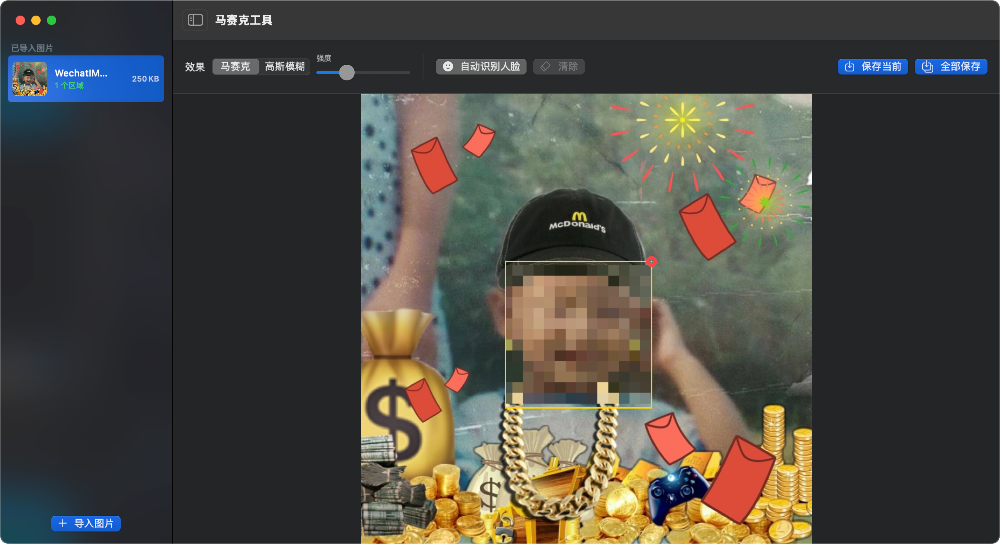
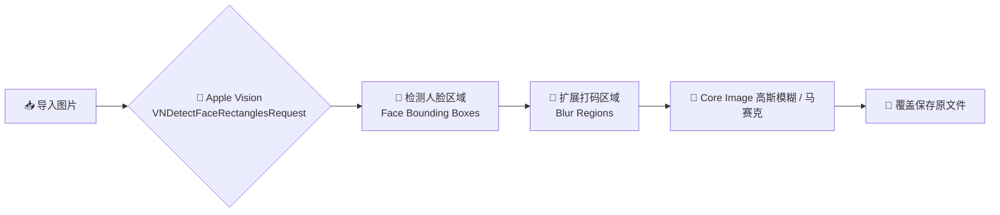

<div align="center">

# 马赛克工具 · Masaiki

**轻量级 macOS 图片打码工具**

[](https://github.com/jhihhe/masaiki)
[](https://swift.org)
[](https://developer.apple.com/xcode/swiftui/)
[](https://www.apple.com/macos)
[](https://github.com/jhihhe/masaiki)
[](LICENSE)
[](./Masaiki.dmg)

<p>
  <a href="README.en.md">English</a> •
  <a href="#功能特性">功能特性</a> •
  <a href="#安装">安装</a> •
  <a href="#使用说明">使用</a> •
  <a href="#从源码构建">构建</a> •
  <a href="#更新日志">更新日志</a>
</p>

</div>

---

## 功能特性

| 功能 | 描述 |
|------|------|
| 📁 **批量导入** | 一次性导入多张 JPG / PNG / HEIC / TIFF 图片，支持拖拽文件或文件夹 |
| 😊 **自动人脸识别** | 基于 Apple Vision 框架，一键检测并打码人脸区域 |
| 🎨 **两种打码效果** | 马赛克（Mosaic）与高斯模糊（Gaussian Blur） |
| 🖱️ **框选打码** | 拖拽矩形框选区域，实时预览覆盖式打码效果 |
| 💾 **覆盖保存** | 一键保存并直接覆盖原文件，仅保存存在打码操作的图片 |
| 📏 **文件大小控制** | JPEG 质量参数自动匹配，保存后文件大小差异控制在 5% 以内 |

## 界面预览



## Apple Vision 人脸识别流程

Masaiki 使用 Apple Vision 的 `VNDetectFaceRectanglesRequest` 自动定位图片中的人脸，并将其转换为打码区域。



**流程说明**

1. **导入图片**：通过文件面板或拖拽将 JPG / PNG / HEIC / TIFF 图片载入应用。
2. **Apple Vision 人脸检测**：`VNDetectFaceRectanglesRequest` 分析图片，返回每张人脸的边界框（bounding box）。
3. **区域扩展**：为了覆盖完整人脸，检测框会向外扩展约 10%。
4. **应用打码效果**：根据当前设置选择高斯模糊或马赛克，并通过 Core Image 合成到原图上。
5. **覆盖保存**：处理后的图片直接覆盖原文件，无打码操作的图片会自动跳过。

### 官方文档

- [Vision 框架总览](https://developer.apple.com/documentation/vision/)
- [VNDetectFaceRectanglesRequest](https://developer.apple.com/documentation/vision/vndetectfacerectanglesrequest)
- [DetectFaceRectanglesRequest（新版 Swift API）](https://developer.apple.com/documentation/vision/detectfacerectanglesrequest)
- [官方示例：Analyzing a selfie and visualizing its content](https://developer.apple.com/documentation/vision/analyzing-a-selfie-and-visualizing-its-content)

## 安装

1. 下载最新版 `Masaiki.dmg`
2. 双击挂载 DMG，将「马赛克工具」拖入「应用程序」文件夹
3. 首次运行时若提示「无法打开」，请前往 **系统设置 → 隐私与安全性** 点击「仍要打开」

## 使用说明

1. 点击左侧「导入图片」、直接将图片/文件夹拖入应用，或使用工具栏导入按钮
2. 选中需要处理的图片
3. 选择打码效果（马赛克 / 高斯模糊）与强度
4. 点击「自动识别人脸」或在图片上拖拽框选手动打码
5. 点击「保存当前」或「全部保存」覆盖原文件

## 从源码构建

```bash
# 克隆仓库
git clone https://github.com/jhihhe/masaiki.git
cd masaiki

# 编译可执行文件
SDK=/Library/Developer/CommandLineTools/SDKs/MacOSX.sdk
swiftc -sdk $SDK -o Masaiki $(find Sources/Masaiki -name "*.swift")

# 打包成 .app（已包含在仓库脚本中）
# 详见 Package.swift 与 Masaiki.app/Contents/Info.plist
```

> **注意**：当前构建环境为 Intel Mac（x86_64），在 Apple Silicon 设备上需通过 Rosetta 运行。如需原生 Apple Silicon 版本，请在装有完整 Xcode 的环境下重新构建。

---

## 更新日志

### v1.1.0（2026-07-22）

- 拖入新图片后自动切换到最后一张预览
- 「保存当前」/「全部保存」跳过无打码记录图片，并提示已保存/跳过数量
- 取消 backup 文件生成，改为原子写入直接覆盖原文件

### v1.0.0（2026-07-21）

- 默认打码效果改为**高斯模糊**，强度默认 **100%**
- 导入图片后**自动识别人脸并打码**，同时保留手动「自动识别人脸」按钮
- 优化异步处理，提升批量导入时的 UI 流畅度
- 修复高斯模糊坐标翻转导致的实时预览与保存异常
- 修复单张文件与整个文件夹拖入导入失效的问题
- 修复关闭窗口后 Dock 仍显示运行小白点的问题
- 保存时自动跳过未打码的图片，并给出保存/跳过数量提示

---

## 技术架构

```
┌─────────────────────────────────────────┐
│           SwiftUI User Interface        │
│  (ImageListView · EditorView · Toolbar) │
└─────────────────────────────────────────┘
                    │
┌─────────────────────────────────────────┐
│           AppViewModel                  │
│   (State · Import · Save · Coordination)│
└─────────────────────────────────────────┘
        │           │           │
   ┌────┘      ┌────┘      ┌────┘
   ▼           ▼           ▼
Vision      Core Image    ImageIO
Face Detect  Mosaic/Blur   JPEG/PNG Save
```

### 核心依赖

- **SwiftUI** — 原生 macOS 用户界面
- **Vision** — 人脸检测（`VNDetectFaceRectanglesRequest`）
- **Core Image** — 马赛克与高斯模糊滤镜
- **ImageIO / UniformTypeIdentifiers** — 图片元数据与格式保持

---

## 免责声明

本工具会直接覆盖原文件，请在操作前确认已自行备份重要图片。

---

<div align="center">

Made with ❤️ for macOS

</div>
